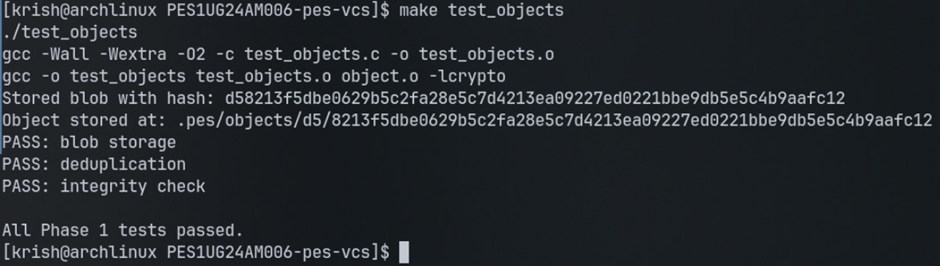
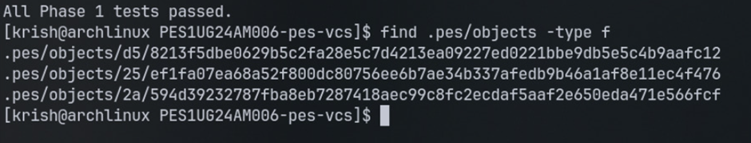
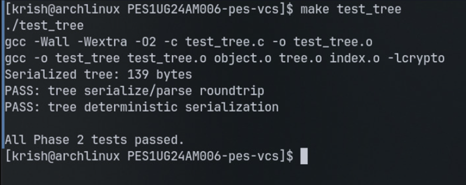
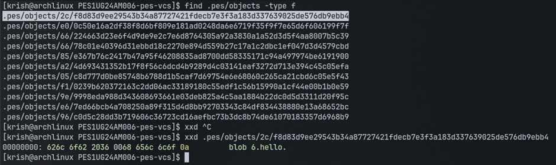
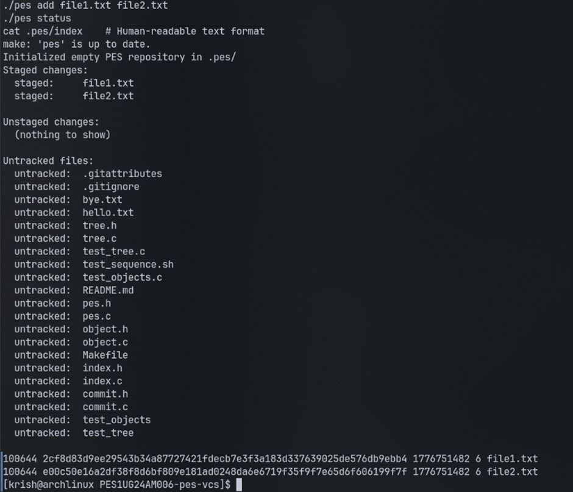
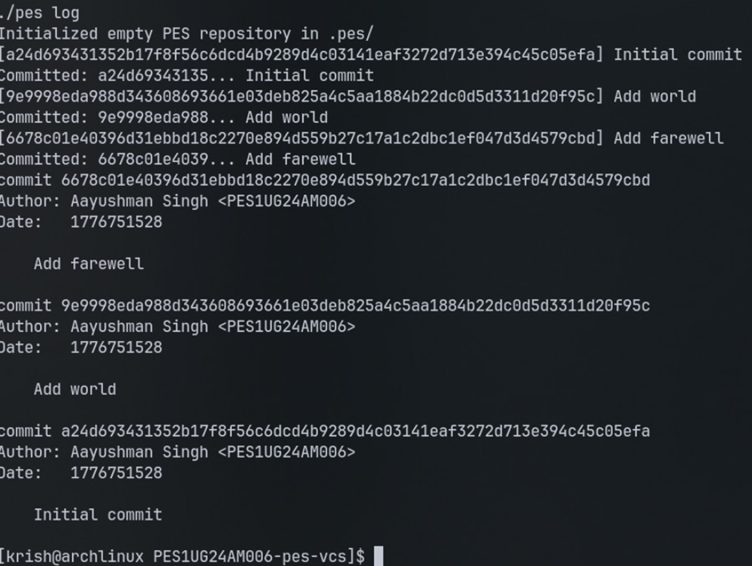
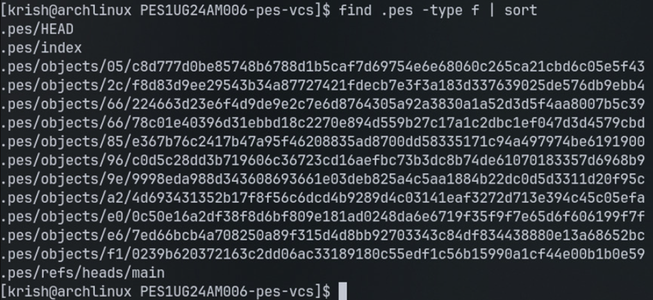
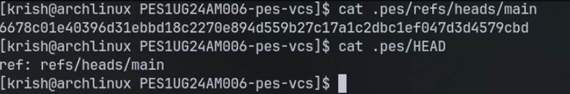

# PES Version Control System (PES-VCS)

## Overview

This project implements a simplified version control system inspired by Git. It covers core concepts such as object storage, indexing, tree construction, commits, and repository structure across multiple phases.

Name:Aakash Desai

SRN:PES1UG24CS006

---
## Screenshots

### Phase 1

#### 1A - Object Tests


#### 1B - Object Store Structure


---

### Phase 2

#### 2A - Tree Tests


#### 2B - Tree Object (xxd)

---

### Phase 3

#### 3A - Add and Status


---

### Phase 4

#### 4A - Commit Log


#### 4B - Object Growth


#### 4C - Refs and HEAD


---


## Analysis Questions

### Q5.1 — Branching and Checkout

To implement `pes checkout <branch>`, the following changes are required:

* Update `.pes/HEAD` to point to `refs/heads/<branch>`.
* Read the commit hash stored in `.pes/refs/heads/<branch>`.
* Load the corresponding commit object.
* Extract the tree associated with that commit.
* Update the working directory to match that tree.
* Update `.pes/index` to reflect the new state.

The working directory must:

* Add new files from the target tree
* Remove files not present in the target tree
* Overwrite modified files

**Complexity arises because:**

* The working directory may contain uncommitted changes
* Files may conflict between current and target branch
* Partial updates must be avoided to maintain consistency

---

### Q5.2 — Detecting Dirty Working Directory

To detect conflicts using only the index and object store:

1. For each tracked file in the index:

   * Read its stored hash (from index)
   * Compute the current file’s hash from disk

2. If hashes differ → file is modified (dirty)

3. Compare:

   * Current branch tree vs target branch tree
   * Identify files that differ between branches

4. If a file:

   * Is modified in working directory **AND**
   * Has different content in target branch

→ **Abort checkout**

This ensures no user changes are accidentally overwritten.

---

### Q5.3 — Detached HEAD

In detached HEAD state:

* `.pes/HEAD` contains a commit hash instead of a branch reference
* New commits are created but **not attached to any branch**

**What happens:**

* Commits exist but are “floating” (unreferenced)
* They may be lost if garbage collection occurs

**Recovery methods:**

* Create a new branch pointing to that commit:

  ```
  pes branch <new-branch>
  ```
* Or manually update a ref to that commit

---

## Garbage Collection and Space Reclamation

### Q6.1 — Finding and Deleting Unreachable Objects

**Algorithm:**

1. Start from all branch heads (`.pes/refs/heads/*`)
2. Traverse:

   * Commit → Tree → Blob
3. Mark all visited objects as reachable
4. Scan `.pes/objects`
5. Delete objects not in reachable set

**Data Structure:**

* Use a **hash set** for efficient lookup of reachable object IDs

**Estimation:**
For:

* 100,000 commits
* 50 branches

Worst case:

* ~100,000 commits
* ~100,000 trees
* Multiple blobs per commit

Total objects visited ≈ **200,000–500,000 objects**

---

### Q6.2 — GC and Concurrency Issues

Running GC concurrently with commits is dangerous due to race conditions.

**Example race condition:**

1. Commit process creates objects (blob, tree, commit)
2. Before updating branch reference, GC runs
3. GC sees objects as unreachable (no refs yet)
4. GC deletes them
5. Commit then tries to reference deleted objects → corruption

**How Git avoids this:**

* Uses **atomic reference updates**
* Writes objects first, then updates refs safely
* Uses **locking mechanisms**
* GC runs only when repository is stable
* Uses temporary references during operations

---

## Conclusion

This project demonstrates the internal working of a version control system, including object storage, indexing, tree construction, commits, and repository management. It also highlights advanced concepts like branching, checkout safety, and garbage collection.

---
